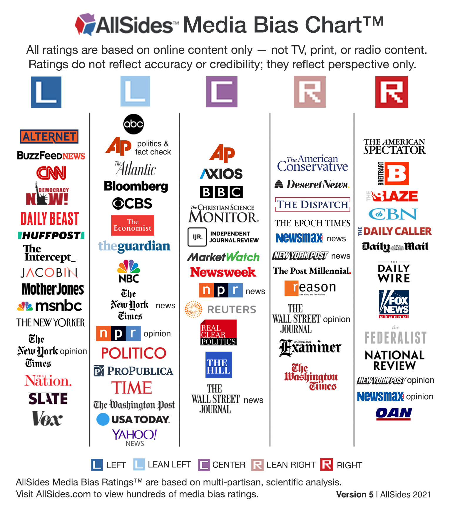

    

      "A nice quote about feminism in the media here"
    

# Abstract and Objectives

 {: style="text-align: justify" } 
 Feminism is a range of social movements, political movements, and ideologies that aim to define and establish the political, economic, personal, and social equality of the sexes. Somehow, to this day there are many in the Western society that shy away from defining themselves as pro-feminists, and many even oppose it. In fact, feminism is still a very controversial and politicized topic.

 {: style="text-align: justify" } 
 In this project, we aim to shed a light on the evolution of feminism between 2015 and 2020 and its relation with the media, using the [Quotebank](https://zenodo.org/record/4277311#.YbEcOWZKj0o) dataset. In particular, we would like to analyze the media coverage that feminism is receiving, both in terms of volume and sentiment. Furthermore, we will try to understand whether feminism is also being applied in practice by each media outlet.

{: style="text-align: justify" } 
The dataset used for our analysis is the Quotebank dataset that consists of 178 million unique, speaker-attributed quotations that were extracted from 196 million English news articles. As the investigated topic is feminism, some related quotes are extracted by making use of key words such as "feminism", "patriarchy", "sexism", "misogyny", "misandry", "gynocentrism",  "rape culture", "slut shaming", "women’s rights", "toxic masculinity", etc.

{: style="text-align: justify" }
Below is a representation of the words present in the 20'052 quotes obtained. As the size is proportional to the frequency, we notice that these quotes are mostly about women and men, people's opinions ("think") and some recurrent feminism related sub-topics ("sexism", "patriarchy", "misogyny"). 

{: style="text-align: justify" }

Let's have a look at the topics covered in these feminism related quotes.

{:refdef: style="text-align: left;"}

{: refdef}

The above LDA model is built with 8 different topics where each topic is a combination of keywords and each keyword contributes a certain weightage to the topic. Each bubble on the left-hand side plot represents a topic. The larger the bubble, the more prevalent is that topic.

Based on the salient keywords, we can guess a possible topic. Topics 1, 2, 3, 4, 7 are clustered in one quadrant and some of them overlap. On the other hand, 5,6 and 8 are situated in 2 different regions and there is no overlap.

The topics in the upper right quadrant are centered around **feminism** which is the central theme of this analysis. Also, many quotes seem to mention personal opinions (**think**, **believe**) and wishes (**want**). Others touch upon **gender rights**  and **equality** between **men** and **women** and the **movements** these can generate (women **fighting** for their rights or against **misogyny**/**patriarchy**, etc.).

Topics 5 and 6 are centered around the fear of people that are perceived as different and their discrimination (**racism**, **sexism**, **homophobia**, **misogyny**, **xenophobia**, **anti**, **hate**). Notice how America's ex-president's name is also mentioned in topic 5. This may allude to the fact that some of these quotes mention opinions on his behaviour and character. 

The last topic (8) revolves around the two politicians **Donald Trump** and **Hillary Clinton** and most probably the man's gender based attacks. The ex-president has been accused several times of **misogyny** and **sexism** in attacking Hillary Clinton because she is a woman. Therefore, the emergence of such a topic is not surprising.

{: style="text-align: justify" }
We will mainly focus on a subset of medias, namely the AllSides Media Bias Chart shown below. 

