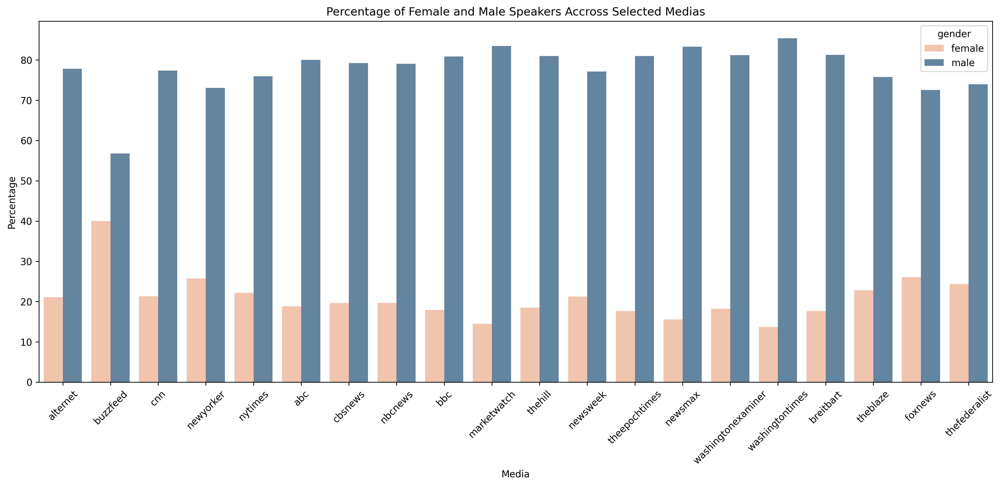

    

      "A nice quote about feminism in the media here"
    

# Abstract and Objectives

 {: style="text-align: justify" } 
 Feminism is a range of social movements, political movements, and ideologies that aim to define and establish the political, economic, personal, and social equality of the sexes. Somehow, to this day there are many in the Western society that shy away from defining themselves as pro-feminists, and many even oppose it. In fact, feminism is still a very controversial and politicized topic.

 {: style="text-align: justify" } 
 In this project, we aim to shed a light on the evolution of feminism between 2015 and 2020 and its relation with the media, using the [Quotebank](https://zenodo.org/record/4277311#.YbEcOWZKj0o) dataset. In particular, we would like to analyze the media coverage that feminism is receiving, both in terms of volume and sentiment. Furthermore, we will try to understand whether feminism is also being applied in practice by each media outlet.

{: style="text-align: justify" } 
The dataset used for our analysis is the Quotebank dataset that consists of 178 million unique, speaker-attributed quotations that were extracted from 196 million English news articles. As the investigated topic is feminism, some related quotes are extracted by making use of key words such as "feminism", "patriarchy", "sexism", "misogyny", "misandry", "gynocentrism",  "rape culture", "slut shaming", "women’s rights", "toxic masculinity", etc.

{: style="text-align: justify" }
Below is a representation of the words present in the 20'052 quotes obtained. As the size is proportional to the frequency, we notice that these quotes are mostly about women and men, people's opinions ("think") and some recurrent feminism related sub-topics ("sexism", "patriarchy", "misogyny"). 

{: style="text-align: justify" }
Now, first, let's see if we can gain insight on the coverage of feminism over time in the medias through the Quotebank dataset. Later on, we will compare between medias from different sides of the political spectrum.

{: style="text-align: justify" }
We can see that the ratio of feminism-related quotes is highest for the years 2016, 2017 and 2018. What events could have caused an increase in the reactions of speakers over feminism at these periods? 

{: style="text-align: justify" }
- In 2016, Hillary Clinton becomes The First Female Presidential Nominee. Clinton championed women's rights as the center of her campaign and Donald Trump was repeatedly accused for his misogynistic rhetoric and machismo. Also, in one of the most important campaign speeches of the 2016 presidential election, First Lady Michelle Obama addressed the dangerous rape culture present in the country. 
- In 2017, 3.5-5.5 million of people worldwide attend the “women’s march” on the 21st of January in solidarity for women’s rights. It’s one of the numerous mass uprisings that mark the decade, including: in India, following the gang rape of a student; across Latin America after a succession of femicides; and in Nigeria, following the kidnapping of almost 280 school girls.
- The #MeToo movement began at the end of 2017. It all began with survivors sharing their sexual harassement and sexual assault stories, but escalated in a global movement that brought social and legal changes. 

{: style="text-align: justify" }
All these historic episodes might explain the presence of a higher number of feminism-related quotes as people were probably keen on expressing their opinion and medias quoted them as well as those who were part of these events. 

{: style="text-align: justify" }
To compare between medias with different political orientations, let us first define the medias of interest. In the subsequent analysis, we will mainly focus on a subset of medias based on the [AllSides Media Bias Chart](https://www.allsides.com/media-bias/media-bias-chart). 

| Left          | Center Left        | Center       | Center Right         |Right            |
|:---           |:---                |:---          |:---                  |:---             |
| Alternet      | The New York Times | BBC          | The Epoch Times      | Breitbart       |
| BuzzFeed      | ABC                | MarketWatch  | Newsmax              | The Blaze       |
| CNN           | CBS                | The Hill     | Washington Examiner  | Fox News        |
| The New Yorker| NBC                | Newsweek     | The Washington Times | The Federalist  |

{: style="text-align: justify" }
Now that the medias of interest have been defined together with their political orientation, let's see how do they compare in terms of ratio of feminism-related quotes. Intuitively this should get an indication of the exposure that media outlets give to feminism.

{: style="text-align: justify" }
While we can't find a correlation between the political orientation and the exposure given to feminism from the plots above, it is interesting to see that *The Federalist* (right-wing) has the highest number of feminism-related quotes with respect to its total number of quotes for the years 2015, 2017 and 2018. Furthermore, *The Blaze* and *Washington Examiner* are also right-wing and center-right respectively. Generally, the left-wing is characterized by an emphasis on ideas such as freedom, equality, fraternity, rights, progress, reform and internationalism while the right-wing is characterized by an emphasis on notions such as authority, hierarchy, order, duty, tradition, reaction and nationalism. Accordingly, we doubt that *The Federalisz* actually has a feminist agenda. In fact, just talking about feminism doesn't mean talking about it in good terms. Also, a media outlet could be very well quoting feminist speakers, just to heavily criticize them and promote an opposite view.

{: style="text-align: justify" }
Let's have a look at the topics covered in these feminism related quotes.

    

        
    

 {: style="text-align: justify" }   
The above LDA model is built with 8 different topics where each topic is a combination of keywords and each keyword contributes a certain weightage to the topic. Each bubble on the left-hand side plot represents a topic. The larger the bubble, the more prevalent is that topic.

{: style="text-align: justify" }
Based on the salient keywords, we can guess a possible topic. Topics 1, 2, 3, 4, 7 are clustered in one quadrant and some of them overlap. On the other hand, 5,6 and 8 are situated in 2 different regions and there is no overlap.

{: style="text-align: justify" }
The topics in the upper right quadrant are centered around **feminism** which is the central theme of this analysis. Also, many quotes seem to mention personal opinions (**think**, **believe**) and wishes (**want**). Others touch upon **gender rights**  and **equality** between **men** and **women** and the **movements** these can generate (women **fighting** for their rights or against **misogyny**/**patriarchy**, etc.).

{: style="text-align: justify" }
Topics 5 and 6 are centered around the fear of people that are perceived as different and their discrimination (**racism**, **sexism**, **homophobia**, **misogyny**, **xenophobia**, **anti**, **hate**). Notice how America's ex-president's name is also mentioned in topic 5. This may allude to the fact that some of these quotes mention opinions on his behaviour and character. 

{: style="text-align: justify" }
The last topic (8) revolves around the two politicians **Donald Trump** and **Hillary Clinton** and most probably the man's gender based attacks. The ex-president has been accused several times of **misogyny** and **sexism** in attacking Hillary Clinton because she is a woman. Therefore, the emergence of such a topic is not surprising.

{: style="text-align: justify" }
Having studied "the popularity" of feminism and its sub-topics, we now investigate gender equality "in practice". Let's have a look at what exposure is given to female VS male speakers in the selected medias.

{: style="text-align: justify" }
The plot above shows a significant difference between the male and female quotes exposure in all the chosen medias. In the majority of cases, about 80% of the quotes are male which highly contrasts with an approximate 20% of women quotes. The media that quotes women the most is *buzzfeed* (a left-wing media), but the male quotes are still predominant. *The Washington Times* (a right-wing media), on the other hand, chooses to put forward mostly male speakers.

{: style="text-align: justify" }
Earlier we mentioned the difference in ideas that each wing emphasises, therefore, it does not seem surprising that a left-wing media has the highest percentage of women quotes whilst a right-wing media has the lowest one. Nevertheless, we would have expected more left-wing medias to quote women as much as they quote men.

What about the speakers from the feminism dataset?

 

The situation switches in the case of feminism related quotes: the predominant gender is female. We suppose that women are more concenrned about feminism and its sub-topics, so they are the ones who are vocal about the related issues. As a consequence, medias cite them more often.

